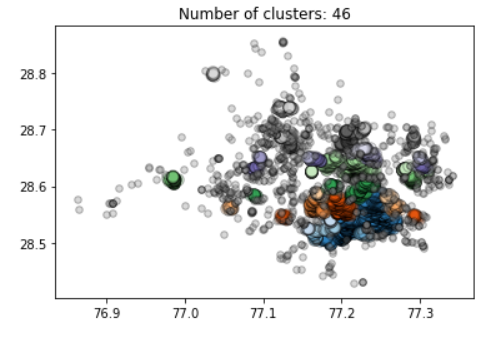

Identifying Commercial Centers/Markets
====================================================

Identifying commercial centers using Points of Interest (POI) OSM data for New Delhi using DBSCAN (Density-Based Spatial Clustering of Applications with Noise) algorithm.

##### The following map highlights the results (all the commercial centers/markets) obtained after analysis.


##### The following scatter plot provides an overview of the clusters for markets identified during analysis.
x-axis - Longitude, y-axis - Latitude


Setup
----------------------
1) Setup a conda environment or virtualenv.
2) Install requirements.txt.

   Steps:-
   
   ```$ pip install virtualenv ```
   
   ```$ virtualenv myenv```

   ```$ myenv\Scripts\activate```

   ```$ pip install -r requirements.txt```
   
   
Description of the files
-----------------------------
-  clustered.csv - Contains cluster labels for all the commercial nodes.
-  markets.csv - Contains centre points for all the clusters/markets identified in New Delhi region.
-  data_manip.ipynb - Collection, cleaning and visualization of data obtained using overpass API, pandas and numpy.
-  clustering.ipynb - Algorithm for clustering. Analysis and visualization of results using Scatter Plots, Bar Plots, gmplot and Reverse Geocoding.
-  map_delhi.html - Market coordinates plotted on the map of New Delhi.
-  market_coor_shape_files.zip - zip file containing shape file for coordinates of identified markets.
-  requirements.txt - Dependencies required for running the scripts.
-  All other json and pickle files contain data obtained after different stages during the analysis.
