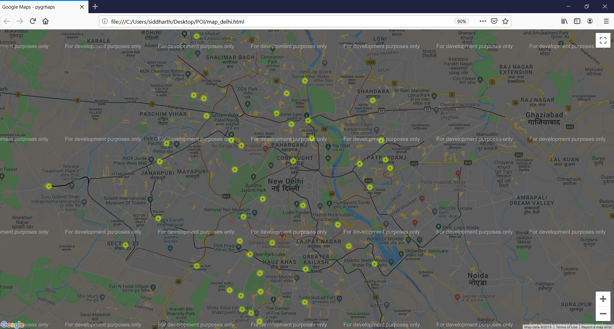

Identifying Commercial Centers/Markets
====================================================

Identifying commercial centers using Points of Interest (POI) OSM data for New Delhi.

##### The following map highlights the results (all the commercial centers/markets) obtained after analysis.



Setup
----------------------
1) Setup a conda environment or virtualenv.
2) Install requirements.txt.

   
   ``` pip install virtualenv ```
   
   ```virtualenv myenv```

   ```myenv\Scripts\activate```

   ```pip install -r requirements.txt```
   
   
